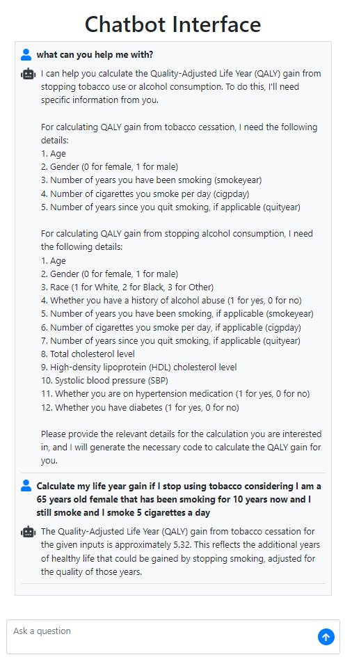

# Integrating LLMs with CBK for Clinical Decision Support
**This is an experimental system for research purposes only. It is not intended for medical use.**
We have implemented a conversational chatbot that clinicians can use to perform calculations. By integrating with Computational Biomedical Knowledge (CBK), ensure computations rely on curated, evidence-based rules, thereby avoiding hallucinations and nondeterminism, which unaided LLMs may be prone to. We implemented this chatbot in two different ways, for purposes of comparison:

## Intelligent Chatbot for Biomedical Knowledge Retrieval and Execution, Using Retrieval-Augmented Generation with LLMs
We implemented a pipeline in a prototype chatbot that leverages LLMs for natural language understanding and retrieval-augmented generation, using biomedical knowledge objects as contexts to answer biomedical questions with expert knowledge. To execute knowledge representations (code) attached to each knowledge object, we integrated an OpenAI Assistant API with a code_interpreter tool into our pipeline. This implementation is more reliable compared to other approaches that do not use a code_interpreter tool, examples of which are available in the archive folder of this repository. Here is an example output for this prototype chatbot:


## LLM with Computational Biomedical Knowledge Object (KO) implementations registered as tools
In this alternative architecture, the LLM is aware of the KO implementations available to it, and invokes them when it deems it necessary. The main advantage of this approach is that all KO implementation code is guaranteed to be executed exactly as written in the local native Python environment. Additionally, execution is faster and cheaper.

## Environment setup
Make sure poetry is installed
Clone the repository using
```
git clone https://github.com/kgrid-lab/LLM_with_RAG_chatbot.git
```

setup a virtual environment using poetry
```
cd LLM_with_RAG_chatbot
poetry env use 3.11
poetry shell
poetry install
```

Create a .env file in the root of the project and store the following values in it
```
KNOWLEDGE_BASE="KO/"
MODEL="gpt-4o"
EMBEDDING_MODEL="text-embedding-3-small"
EMBEDDING_DIMENSION=1536
EVAL_MODEL="gpt-4o"
MODEL_SEED=1762259501
OPENAI_API_KEY="YOUR_OPENAI_API_KEY"
OPENAI_ADMIN_KEY="YOUR_OPENAI_ADMIN_KEY"
```
- The KNOWLEDGE_BASE points to the location of knowledge object context files. Currently "KO" and "KO/clinical_calculators" are supported.
- MODEL defines which OpenAI language model to use. We used "gpt-4o" (or "gpt-4o-mini" for SLM). We have not yet tried the reasoning models "o1" or "o3-mini" because the purpose of this project is to offload complex reasoning/computation to functions. We currently do not support vendors other than OpenAI.
- EMBEDDING_MODEL defines which OpenAI embedding model to use. We used "text-embedding-3-small" because of its low cost.
- EMBEDDING_DIMENSION is the length of the embedding generated by the model. We used the OpenAI default of 1536.
- EVAL_MODEL defines which OpenAI language model to use for evaluation of language model output.
- MODEL_SEED provides a numerical seed to the OpenAI language model specified by MODEL. Specifying MODEL_SEED is optional. It only affects MODEL, not EVAL_MODEL.
- Get your own API key at [OpenAI's API keys section](https://platform.openai.com/api-keys) and set OPENAI_API_KEY with its value.
- Similarly, get your own Admin key at [OpenAI's Admin keys section](https://platform.openai.com/settings/organization/admin-keys) and set OPENAI_ADMIN_KEY with its value.

## Run the app 
Once the environment is set up you can run this app from the command line using
```
python src/chatbot_cmd.py 
```

To run this app in a web interface, use 
```
python src/chatbot_ui.py
``` 
and point your browser to http://localhost:5000

## Testing
To test the performance of the chatbot, use the test_chatbot_conversation.py script. It supports running multiple chatbots on multiple conversations for multiple trials. For example, to produce the results shown in tables 1 and 3-5 of our paper, run:
```
python tests/test_chatbot_conversation.py -a PlainLlm LlmWithKoRagMetadataAndCodeTools -c tests/comprehensive_convo.json tests/shorthand_convo.json tests/calculator_inquiry_convo.json tests/metadata_convo.json -n 5
```
A run of this test script will produce both a log file and a CSV file with names containing the timestamp the script was invoked. The CSV file contains key results at the top, followed by item-by-item results.

## Previous Version
A working copy of the previous version of the chatbot is in llm_with_rag_chatbot. Consult the [README within that folder](/llm_with_rag_chatbot/README.md) for instructions to operate it.
